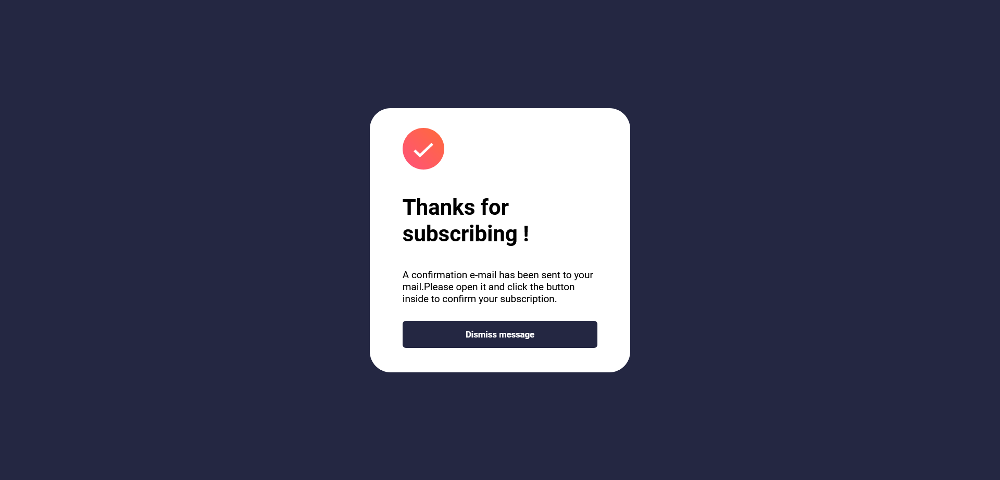

# Frontend Mentor - Newsletter sign-up form with success message solution

This is a solution to the [Newsletter sign-up form with success message challenge on Frontend Mentor](https://www.frontendmentor.io/challenges/newsletter-signup-form-with-success-message-3FC1AZbNrv). Frontend Mentor challenges help you improve your coding skills by building realistic projects. 

## Table of contents

- [Overview](#overview)
  - [The challenge](#the-challenge)
  - [Screenshot](#screenshot)
  - [Built with](#built-with)
  - [What I learned](#what-i-learned)
  - [Continued development](#continued-development)
  - [Useful resources](#useful-resources)
- [Author](#author)

## Overview

### The challenge

Users should be able to:

- Add their email and submit the form
- See a success message with their email after successfully submitting the form
- See form validation messages if:
  - The field is left empty
  - The email address is not formatted correctly
- View the optimal layout for the interface depending on their device's screen size
- See hover and focus states for all interactive elements on the page

### Screenshot

### Built with

- Semantic HTML5 markup
- CSS custom properties
- Flexbox
- CSS Grid
- Mobile-first workflow

### What I learned

layout and website design, structuring components correctly,the parent-child and sibling relation between elements in css, and the last but not the least best practices when writing css.
learned a new way to create space around components using padding.Also my first time venturing into jQuery,used jquery for dom-manipulation and changinf the color of the input field when an incorect email is entered.

I am deploying this application using netlify, and it is also my first time using netlify, so that is something i learned through this project.

### Continued development

The responsive design part of the website can be improved upon.

### Useful resources

- [video resource 1](https://www.youtube.com/@KevinPowell) - This helped me for a lot of reasons. I really liked this channel and will use it going forward.
- [Text resource 2](https://www.javatpoint.com/jquery) - This is an amazing site which helped me introduce and understand the basics of jQuery. I'd recommend it to anyone still learning this concept.

## Author

- Website - [Mehul lunia]
- Frontend Mentor - [@Mehul-lunia](https://www.frontendmentor.io/profile/Mehul-lunia)

